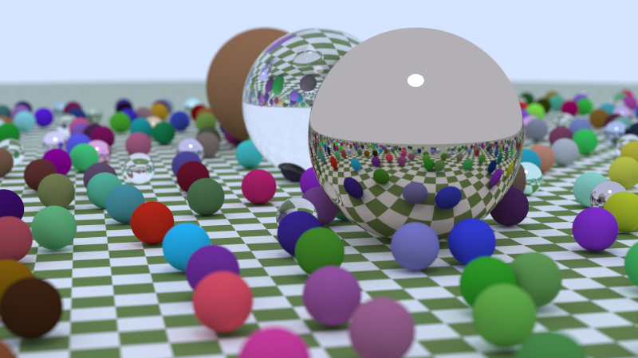
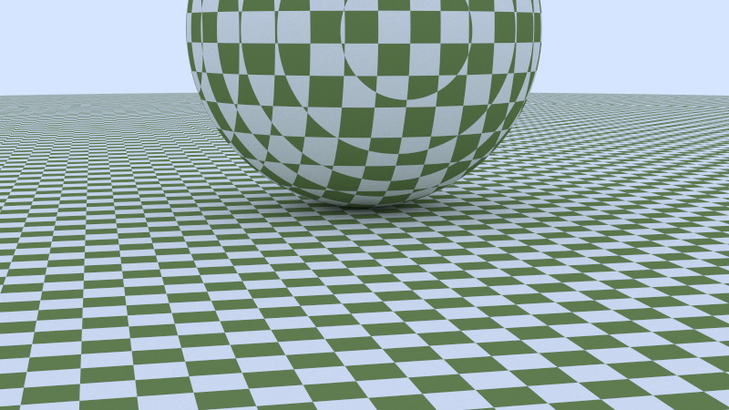
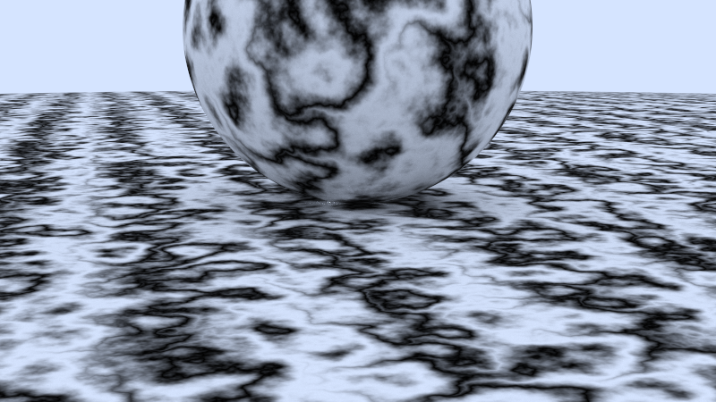
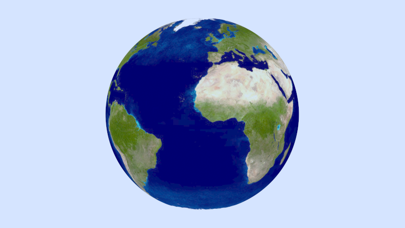

# Introduction

This project is a `rust` implementation of a cpu-based raytracer based on the series:

- [_Ray Tracing in One Weekend_](https://raytracing.github.io/books/RayTracingInOneWeekend.html)

- [_Ray Tracing: The Next Week_](https://raytracing.github.io/books/RayTracingTheNextWeek.html)

- [_Ray Tracing: The Rest of Your Life_](https://raytracing.github.io/books/RayTracingTheRestOfYourLife.html)

This is a personal project to learn `rust` and my first real project in `rust`. As usual, some implementation hints from other similar projects were taken, but the work has been implemented mostly based on the original C++ implementation from the books.

# Todo

Open tasks:

- [ ] Create a more organized structure for the different scenes (perhaps serialize to/from JSON)
- [ ] Continue with the implementations of Book 2
    - [x] Implement bounding volume hierarchy tree to speed up large scene rendering
    - [x] Implement texture support for Lambert material:
        - [x] Rewrite all materials types as trait instead of enum
        - [x] Implement solid color and checker material
        - [x] Implement image texture
    - [x] Implement light emitting material
    - [x] Box and plane geometry
    - [x] Instancing (rotation/translation)
    - [ ] Medium and volumes
- [ ] Implement additional tests for material functions
# Build and Run

The project can be built and executed using `cargo`.

## Build

```shell
cargo build --release
```

## Run

```shell
cargo run --release
```

# Multithreading

To speed up the rendering process, the raytracer is multithreaded, allowing us to evaluate several pixels in parallel threads.

## Rayon

Rayon is used for multithreading, we iterate over each line and map with a parallel iterator over each pixel per line. It was not possible to use a parallel for iterator for all pixels, hence why the parallel iterator is applied for each line.

```rust
for j in (0..image_height).rev() {
    let pixels: Vec<Vector3<f32>> = (0..image_width).into_par_iter().map(|i| {
        get_pixel_color(
            image_width,
            image_height,
            samples_per_pixel,
            &cam,
            &world,
            max_depth,
            i,
            j,
        )
    }).collect();

    for pix in pixels {
        write_color(&mut f, &pix);
    }
}
```

During my brief testing, I also tried calculating each sample per pixel in a seperate thread, but this did not yield any significant speed up. It could be that a single sample is very fast to evaluate with just a few objects in the scene and therefore the overhead of starting of managing the threads outweighs the benefits.

# Output

Scenes with spheres of different materials (Dielectric, Lambertian and Metal)


Dense scene with checkerboard ground material

Sphere with globe image texture

